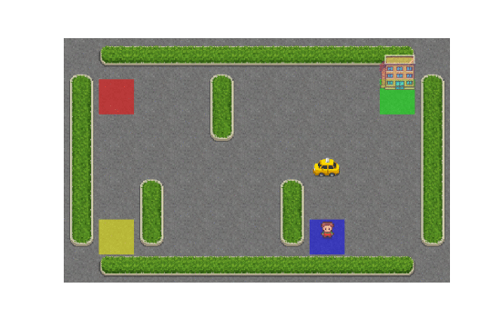
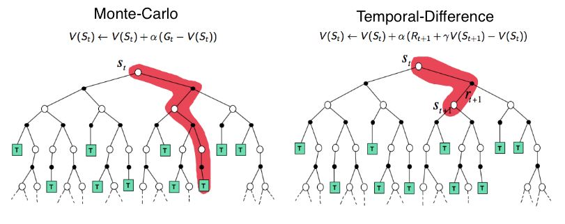
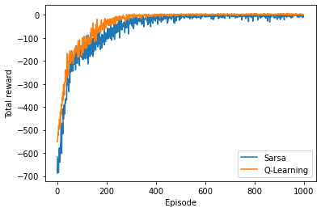

# Sample-Based_RL_Gym

## Overview

{: style="width: 80%; height: auto;" }
*Animation of the Taxi-v3 environment.*

{: style="width: 80%; height: auto;" }
*Comparison of different methods implemented.*
This project implements and trains sample-based reinforcement learning (RL) algorithms from scratch in Python, using the Taxi-v3 environment from OpenAI's Gym. The focus is on analyzing the performance of different algorithms, including Monte Carlo methods and Temporal Difference (TD) methods such as Q-learning and SARSA.

## Methods Implemented

### 1. Monte Carlo Method
- Updates occur only at the end of each episode.
- Evaluates the agent’s performance and convergence speed over multiple episodes.

### 2. Temporal Difference (TD) Methods
- Updates occur at every step, leading to faster convergence compared to Monte Carlo methods.
- Compares Q-learning and SARSA algorithms to evaluate variance in rewards and training speed.

## Key Findings

- TD methods generally exhibited lower variance in rewards and faster training speeds compared to the Monte Carlo method.
- Among Q-learning and SARSA, Q-learning demonstrated less variance in rewards and lower error percentages.

## Results
{: style="width: 80%; height: auto;" }
*Training performance over episodes.*
The performance metrics and analysis of the implemented methods are documented in the provided report. Please refer to the respective files for comprehensive insights into the training outcomes.

